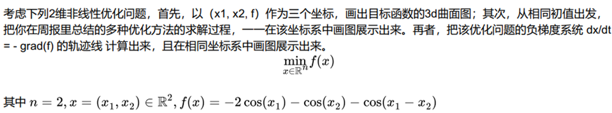
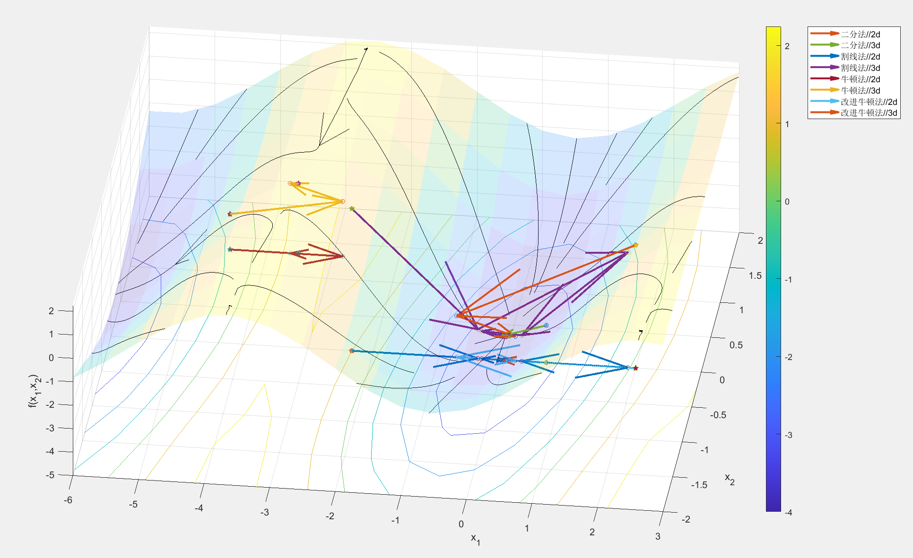
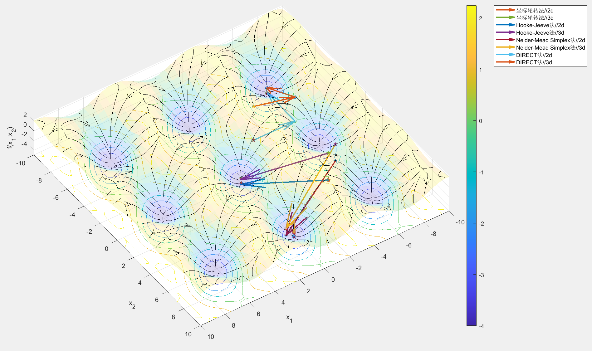
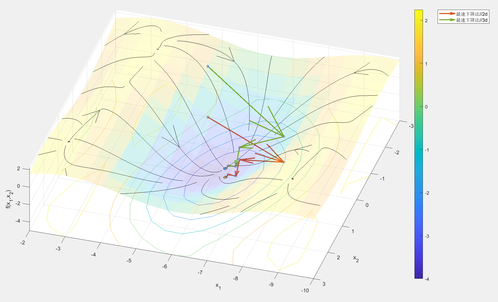
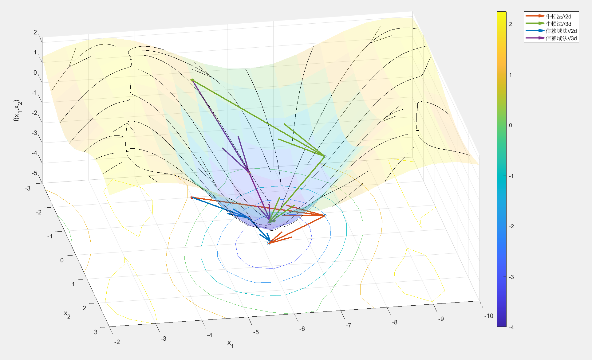
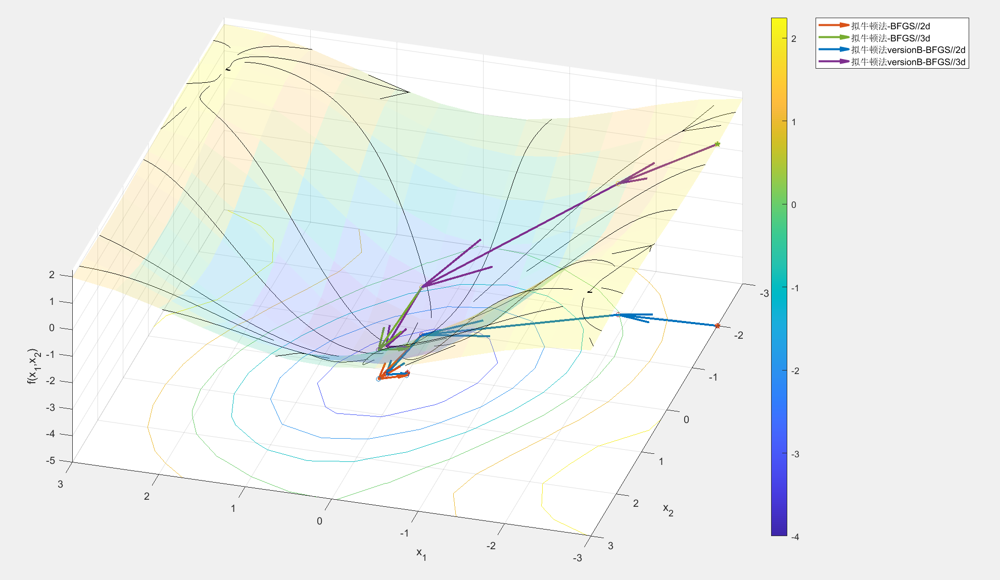
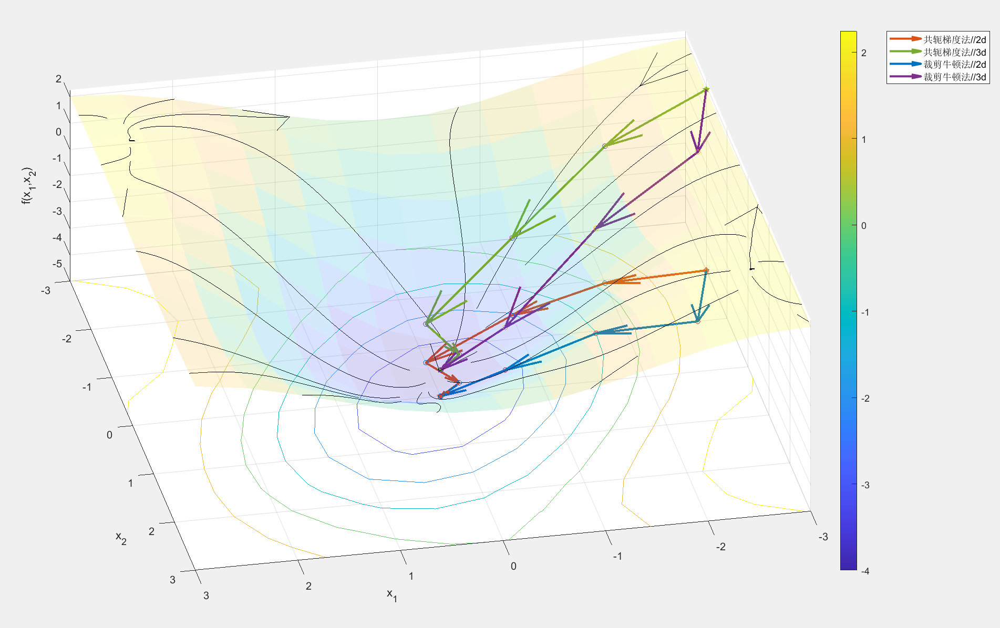

# Code implementation of Nonlinear Optimization With Engineering Applications

代码仓库地址: [wumy27/Code4NonlinearOpt](https://github.com/wumy27/Code4NonlinearOpt)

作者: [BevanWu](mailto:bevn2wu@outlook.com)

## Section 1 - 无约束优化算法

Section One以下面问题为例，展示各算法的迭代过程

第二章的四个优化算法包含二分法、割线法、牛顿法、改进牛顿法，调用`ch2_Ztest.m`即可展现四个算法的优化过程：

第五章的四个优化算法包含坐标轮转法、Hooke-Jeeve(改进的坐标轮转)法、单纯形法、DIRECT法，调用`ch5_Ztest.m`即可展现四个算法的优化过程：

第七章只有最速下降法，调用`ch7_Ztest.m`即可展示其优化过程：

第八章设计了完美线搜索`ch8_PerfectLineSearch.m`与两个弱线搜索`ch8_ArmijoLineSearch.m`、`ch8_ModifiedArmijoLS.m`。

第九章的两个优化算法包含牛顿法、信赖域法，调用`ch9_Ztest.m`即可展示其优化过程：

第十章主要介绍拟牛顿法这一方法，而对二阶信息的近似又分为对其本身or其逆矩阵的近似，这其中又可以使用多种计算公式，如`SR1\BFGS\DFP`，均完成实现。调用`ch10_Ztest.m`即可展示BFGS公式的两种拟牛顿法的优化过程：

第十一章的两个优化方法包含共轭梯度法、裁剪牛顿法，调用`ch11_Ztest.m`即可展示其优化过程：

## Section 2 - 有约束优化算法

to be continued ....

